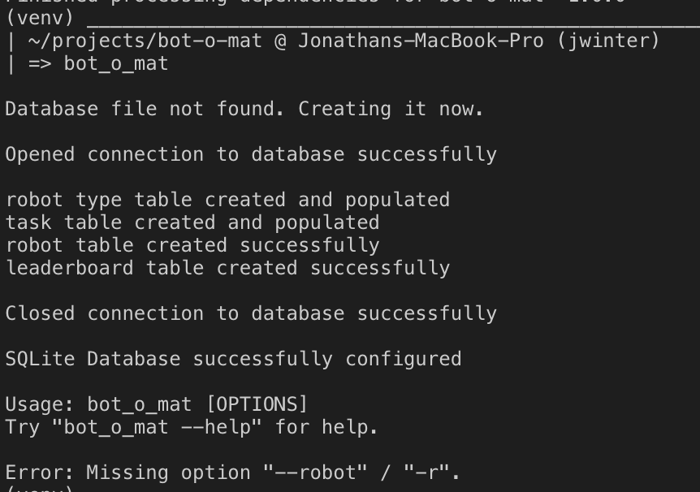

# How to run bot-o-mat

## Requirements

* If using the container setup:
  * [Docker](https://docs.docker.com/install/)
* If executing locally:
  * [Python 3.7](https://www.python.org/downloads/)
  * [SQLite](https://sqlite.org/download.html)

## [Executing with Docker](./run_docker.md)

## [Executing as a package](./run_package.md)

## Local Setup

1. `python3 -m venv ./venv`
2. `source ./venv/bin/activate`
3. `python3 setup.py install`

### How to create Robots to execute assigned tasks

`python3 bot_o_mat/cli.py {-r | --robot} {robot_type} {robot_name}`

#### Example

```shell
python bot_o_mat/cli.py -r Bipedal Bender -r Arachnid Spidey -r Radial BB8
```

### Displaying leaderboard

`python3 bot_o_mat/cli.py leaderboard`

#### Help

You can get help like so

```shell
python3 bot_o_mat/cli.py --help

```

#### First Note

Upon first execution, the application may create its database, so you may see the following



##### Second Note

Displaying the leaderboard will also create a csv file: "bot_o_mat/data/leaderboard.csv"
